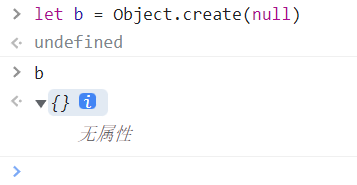

# 原型(显示原型)
1. 原型是函数自带的一个属性 prototype，它定义了构造函数创建的实例对象的公共祖先。通过构造函数创建的对象可以继承该函数原型上的属性

2. 实例对象隐式具有构造函数原型上的属性，且是只读属性

# 原型链
- v8在查找对象的属性时，如果没找到，就会顺着对象的隐式原型上查找，还找不到，再顺着隐式原型的隐式原型往上找,直到找到null为止，在这过程中，但凡有一个步骤能找到，就会返回值。这个链状的查找过程就是原型链

# 隐式原型
- 对象上的__proto__属性，它等于构造函数的prototype属性

# 所有对象都有原型吗？
不是
Object.create(null) 创建的对象没有原型
let b = Object.create(null)
b无属性
